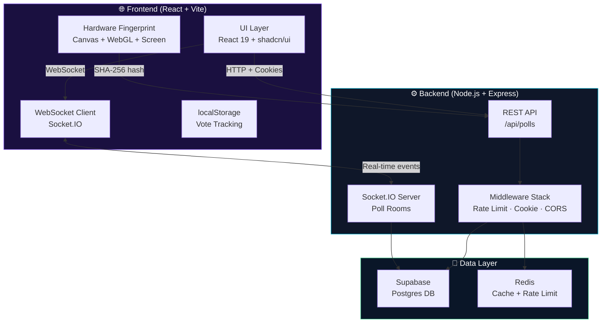
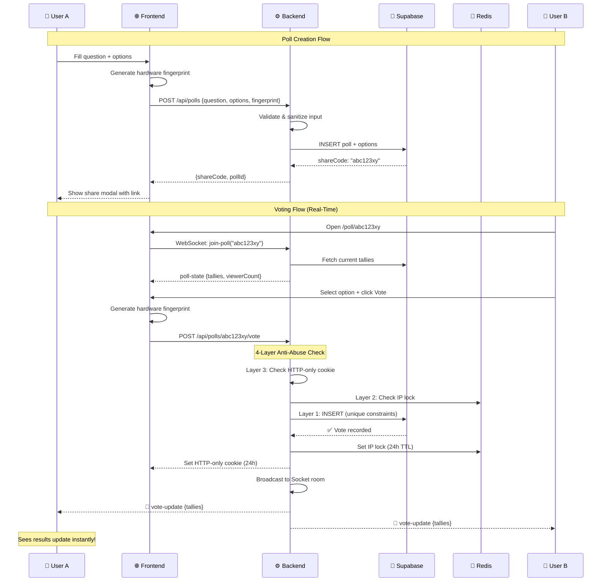
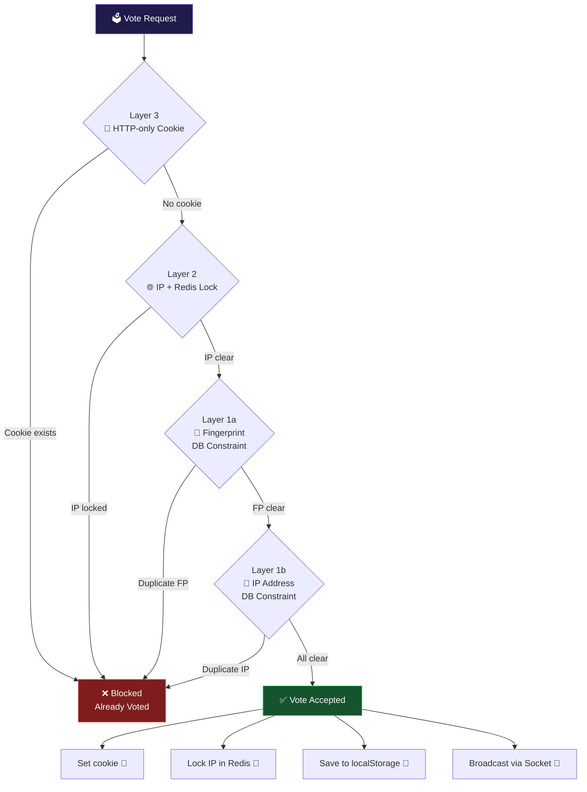
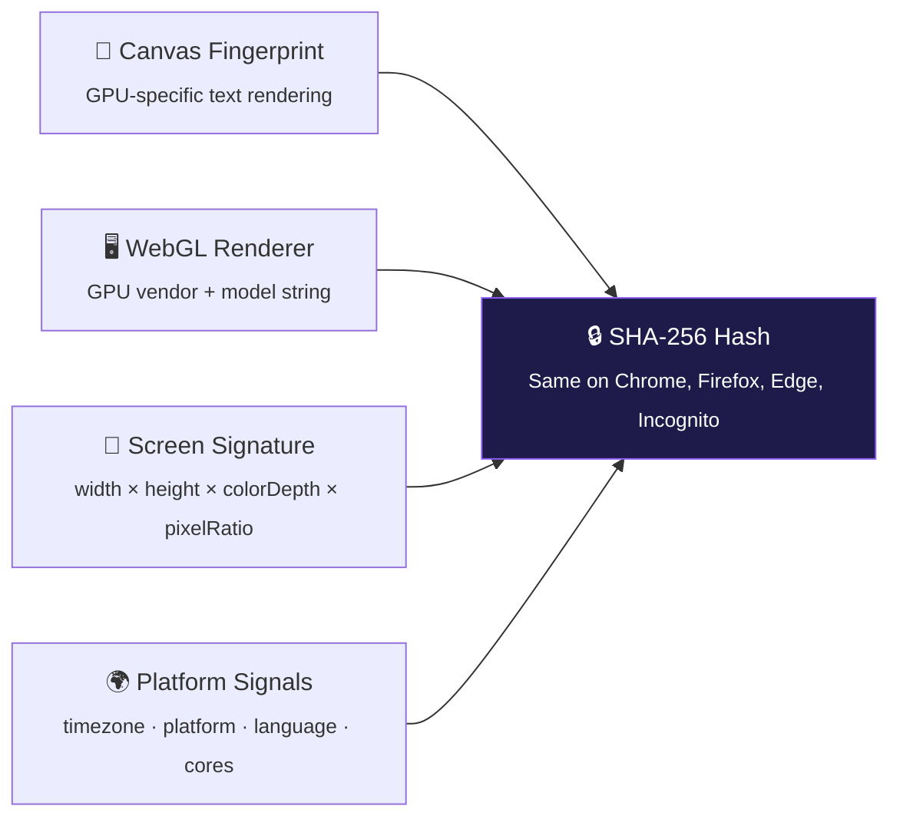

<p align="center">
  
  <br/>
  <strong>Real-Time Poll Rooms</strong>
  <br/>
  <sub>Create instant polls · Share a link · Watch votes stream in live</sub>
</p>

<p align="center">
  
  
  
  
  
  
</p>

---

## 📋 Table of Contents

- [Features](#-features)
- [Architecture](#-architecture)
- [Anti-Abuse / Fairness Mechanisms](#-anti-abuse--fairness-mechanisms)
- [Edge Cases Handled](#-edge-cases-handled)
- [Known Limitations & Future Improvements](#-known-limitations--future-improvements)
- [Tech Stack](#-tech-stack)
- [Getting Started](#-getting-started)
- [Project Structure](#-project-structure)

---

## ✨ Features

| Feature                    | Description                                                                              |
| -------------------------- | ---------------------------------------------------------------------------------------- |
| **Instant Poll Creation**  | Create a poll with a question and 2–10 options in seconds                                |
| **Shareable Links**        | Each poll gets a unique 8-character share code URL                                       |
| **Real-Time Results**      | All viewers see votes update instantly via WebSocket — no refresh needed                 |
| **Multi-Layer Anti-Abuse** | 4 defense layers prevent repeat/abusive voting (see below)                               |
| **Persistent Data**        | Polls, options, and votes stored in Supabase (Postgres) — survive refreshes and sessions |
| **Live Viewer Count**      | See how many people are viewing a poll in real-time                                      |
| **Responsive UI**          | Cosmic dark theme with Framer Motion animations, works on mobile/tablet/desktop          |

---

## ⚡ Performance Metrics (Local Host Baseline)

Tests executed via TestSprite & Custom Node.js Script:

| Metric                     | Result       | UX Assessment |
| -------------------------- | ------------ | ------------- |
| **API Health Check RTT**   | **5.85 ms**  | ⚡ Instant    |
| **WebSocket Handshake**    | **11.65 ms** | ⚡ Instant    |
| **Poll Join to Data Load** | **250 ms**   | 🟢 Fast       |

> **Note on Low Network Areas:**
> The architecture uses **Socket.IO over WebSocket**, which maintains a single persistent connection. This is significantly better for low-bandwidth environments than standard REST polling, as it avoids repeated HTTP handshake overhead. Even with 300ms network latency, the app will remain responsive.

---

## 🏗 Architecture

### High-Level System Design



### Request Flow: Creating & Voting on a Poll



---

## 🛡 Anti-Abuse / Fairness Mechanisms

PulsePoll uses a **4-layer defense system** to prevent repeat and abusive voting, modeled after how platforms like Strawpoll and Mentimeter handle anonymous poll fairness.

### Defense Layers Overview



### Detailed Breakdown

| Layer  | Mechanism                                       | Implementation                                                                                                             | Survives Browser Switch? | Survives Incognito? | Survives VPN? |
| :----: | ----------------------------------------------- | -------------------------------------------------------------------------------------------------------------------------- | :----------------------: | :-----------------: | :-----------: |
| **1a** | **Hardware Fingerprint** (DB unique constraint) | Canvas rendering + WebGL GPU + screen resolution + timezone → SHA-256 hash. Unique index on `(poll_id, voter_fingerprint)` |          ✅ Yes          |       ✅ Yes        |    ✅ Yes     |
| **1b** | **IP Address** (DB unique constraint)           | Partial unique index on `(poll_id, voter_ip)` in Supabase                                                                  |          ✅ Yes          |       ✅ Yes        |     ❌ No     |
| **2**  | **IP Redis Lock**                               | `vote_lock:<ip>:<pollId>` key with 24-hour TTL. Checked before DB insert for fast rejection                                |          ✅ Yes          |       ✅ Yes        |     ❌ No     |
| **3**  | **HTTP-only Cookie**                            | Server-set `pv_<pollId>=1` cookie. `httpOnly` flag prevents JS access. 24-hour `maxAge`                                    |          ❌ No           |        ❌ No        |    ✅ Yes     |
| **4**  | **localStorage** (client-side)                  | `voted_polls` array stored locally. Provides instant UI feedback before hitting the server                                 |          ❌ No           |        ❌ No        |    ✅ Yes     |

### How the Hardware Fingerprint Works

Unlike a random ID (which differs per browser), PulsePoll generates a **deterministic fingerprint** from hardware signals that produce the **same hash across all browsers on the same physical device**:



> **Why canvas fingerprinting works across browsers:** The HTML5 Canvas API renders text and shapes using the device's GPU and OS font rendering engine. The exact pixel output varies by hardware/driver/OS combination but is **identical regardless of which browser** is used on that machine.

---

## 🧩 Edge Cases Handled

### Input Validation & Sanitization

| Edge Case                    | How It's Handled                                                     |
| ---------------------------- | -------------------------------------------------------------------- |
| Empty question               | Server returns `400: Question is required`                           |
| Fewer than 2 options         | Server returns `400: At least 2 options are required`                |
| More than 10 options         | Server returns `400: Maximum 10 options allowed`                     |
| HTML/XSS in input            | All input is stripped of HTML tags and entities via `sanitizeText()` |
| Duplicate options            | Case-insensitive deduplication: `"React"` and `"react"` are caught   |
| Extremely long input         | Question truncated to 500 chars, options to 200 chars                |
| Empty options after sanitize | Filtered out; re-validated for minimum 2                             |

### Voting Integrity

| Edge Case                           | How It's Handled                                              |
| ----------------------------------- | ------------------------------------------------------------- |
| Invalid option ID                   | Server verifies option belongs to the poll before accepting   |
| Vote on inactive poll               | Server returns `403: This poll is no longer accepting votes`  |
| Missing fingerprint                 | Server returns `400: optionId and fingerprint are required`   |
| Race condition (simultaneous votes) | DB unique constraints handle atomically at the Postgres level |
| Option doesn't belong to poll       | Cross-verified: `option.poll_id === poll.id` check            |

### Infrastructure Resilience

| Edge Case                       | How It's Handled                                                                                    |
| ------------------------------- | --------------------------------------------------------------------------------------------------- |
| Redis down                      | **Fail-open** design — rate limiter and cache gracefully degrade; votes still recorded in Supabase  |
| Socket disconnects              | Viewer counts updated on `disconnecting` event; clients auto-reconnect                              |
| Multiple tabs                   | Socket rooms track unique connections; each tab joins independently                                 |
| DB rollback on creation failure | If option insert fails, the poll row is deleted (manual rollback)                                   |
| Vote count cache stale          | Cache invalidated on every new vote; 10-second TTL as safety net                                    |
| Share code collision            | 8-char code from 29-char alphabet = ~540 billion combinations; collision is astronomically unlikely |

---

## ⚠️ Known Limitations & Future Improvements

### Current Limitations

| Limitation                        | Why It Exists                                                          | Impact                                                                     |
| --------------------------------- | ---------------------------------------------------------------------- | -------------------------------------------------------------------------- |
| **VPN bypass**                    | Different VPN = different IP, bypasses IP constraint                   | Low — fingerprint layer still catches same device                          |
| **Different physical device**     | Separate hardware = different fingerprint + different IP               | Expected — each person should get one vote                                 |
| **Canvas fingerprint collision**  | Two devices with identical GPU/OS/screen _could_ produce the same hash | Very rare — signals include multiple dimensions                            |
| **Cookie clearable via DevTools** | Power users can delete httpOnly cookies through browser DevTools       | Low — IP and fingerprint layers still active                               |
| **localStorage erasable**         | Clearing browser data removes local tracking                           | Mitigated — server-side layers (IP, cookie, fingerprint DB) are unaffected |
| **IP TTL is 24 hours**            | After 24h, the Redis IP lock expires                                   | Acceptable — matches industry standard for anonymous polls                 |
| **No authenticated voting**       | Anonymous voting means identity can't be 100% verified                 | By design — assignment specifies no login required                         |

### Future Improvements

| Improvement                       | Benefit                                                        |
| --------------------------------- | -------------------------------------------------------------- |
| **FingerprintJS Pro integration** | Industry-leading 99.5% accuracy device identification          |
| **CAPTCHA on vote**               | Prevents bot/scripted abuse                                    |
| **Poll expiration**               | Auto-close polls after configurable time                       |
| **Vote analytics dashboard**      | Geographic and temporal voting patterns                        |
| **Webhook notifications**         | Notify poll creator when votes come in                         |
| **Auth-optional mode**            | Allow poll creators to require login for higher-security polls |

---

## 🛠 Tech Stack

| Layer           | Technology                                | Purpose                                      |
| --------------- | ----------------------------------------- | -------------------------------------------- |
| **Frontend**    | React 19, Vite 7, TypeScript              | SPA framework                                |
| **Styling**     | Tailwind CSS v4, shadcn/ui, Framer Motion | Dark cosmic theme + animations               |
| **Icons**       | Lucide React                              | Consistent icon system                       |
| **Backend**     | Node.js, Express, TypeScript              | REST API + middleware                        |
| **Real-Time**   | Socket.IO                                 | WebSocket poll rooms                         |
| **Database**    | Supabase (Postgres 17)                    | Persistent storage for polls, options, votes |
| **Cache**       | Redis                                     | Rate limiting, IP locking, vote count cache  |
| **Fingerprint** | Canvas + WebGL + Web Crypto API           | Hardware-based device identification         |

---

## 🚀 Getting Started

### Prerequisites

- Node.js 18+
- Redis server (local or cloud)
- Supabase project (free tier works)

### Environment Setup

1. **Clone the repository**

   ```bash
   git clone https://github.com/SreeAditya-Dev/PulsePoll.git
   cd PulsePoll
   ```

2. **Backend setup**

   ```bash
   cd backend
   npm install
   ```

   Create `.env`:

   ```env
   PORT=4000
   CLIENT_URL=http://localhost:5173
   SUPABASE_URL=your_supabase_url
   SUPABASE_ANON_KEY=your_supabase_anon_key
   REDIS_URL=redis://localhost:6379
   ```

3. **Run database migrations** — Execute the SQL files in `backend/sql/` in order against your Supabase project:

   ```
   001_create_polls.sql
   002_create_poll_options.sql
   003_create_votes.sql
   004_add_ip_constraint.sql
   ```

4. **Frontend setup**

   ```bash
   cd ../frontend
   npm install
   ```

5. **Start development servers**

   ```bash
   # Terminal 1 — Backend
   cd backend && npm run dev

   # Terminal 2 — Frontend
   cd frontend && npm run dev
   ```

6. **Open** [http://localhost:5173](http://localhost:5173)

---

## 📁 Project Structure

```
PulsePoll/
├── backend/
│   ├── src/
│   │   ├── config/          # Supabase + Redis clients
│   │   ├── middleware/       # Rate limiter + IP vote lock
│   │   ├── routes/           # REST endpoints (polls.ts)
│   │   ├── socket/           # Socket.IO room management
│   │   ├── utils/            # Fingerprint hashing, sanitization
│   │   └── index.ts          # Express + Socket.IO server
│   └── sql/                  # Database migration files
├── frontend/
│   ├── src/
│   │   ├── components/       # UI components (Navbar, VotePanel, etc.)
│   │   │   └── ui/           # shadcn/ui primitives
│   │   ├── hooks/            # usePollSocket WebSocket hook
│   │   ├── lib/              # API client, fingerprint, types, utils
│   │   └── pages/            # Home, Poll, NotFound
│   └── index.html
└── README.md
```

---

<p align="center">
  Built with ⚡ by <a href="https://github.com/SreeAditya-Dev">SreeAditya-Dev</a>
</p>
